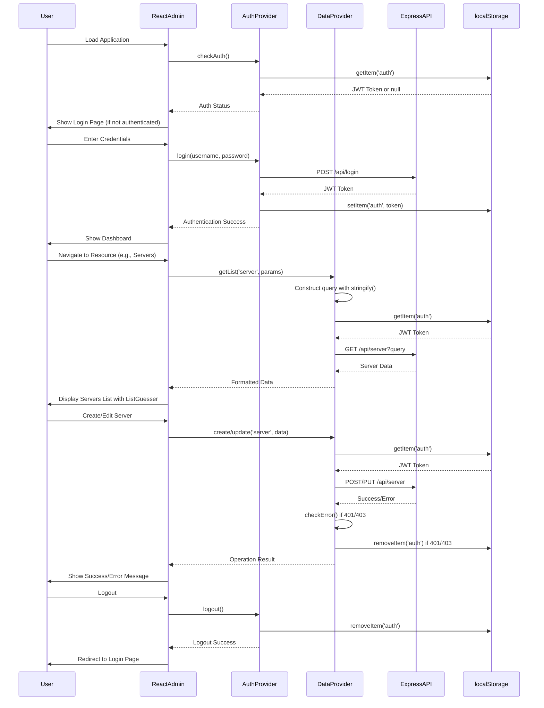
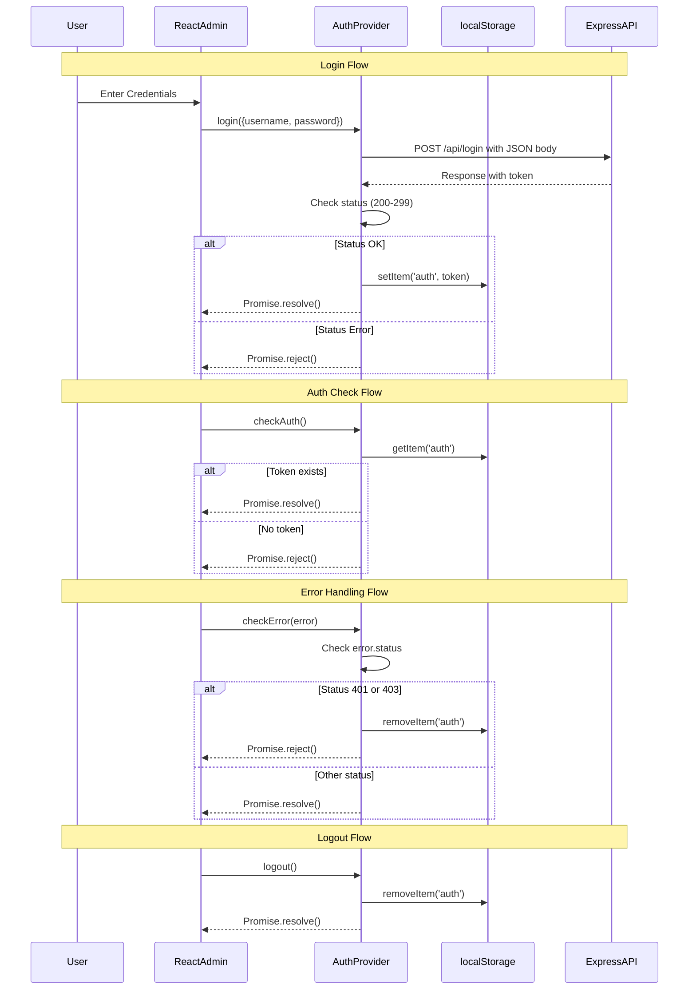

# Enhanced WebUI Architecture Diagram

## High-Level Architecture

```mermaid
graph TD
    A[User] --> B[React Admin Application]
    B --> C[Authentication Provider]
    B --> D[Data Provider]
    B --> E[Theme Provider]
    
    C --> F[Login Page]
    C --> G[JWT Token Management]
    C --> H[Logout Function]
    C --> I[Error Handling]
    
    D --> J[REST API Endpoints]
    J --> K[/api/server]
    J --> L[/api/shell/session]
    J --> M[/api/activity]
    J --> N[/api/command]
    J --> O[/api/file]
    J --> P[/api/model]
    J --> Q[/api/chat]
    J --> R[/api/login]
    
    E --> S[Dark Theme Configuration]
    E --> T[Material UI Components]
    
    B --> U[Express Server]
    U --> V[Static File Serving]
    V --> W[client/dist Directory]
```

## Component Structure with Implementation Details

```mermaid
graph TD
    A[App.jsx] --> B[Admin Context]
    A --> C[Resource Definitions]
    A --> D[Theme Configuration]
    
    B --> E[Layout Components]
    E --> F[Menu]
    E --> G[AppBar]
    E --> H[Notification]
    E --> I[Sidebar]
    
    C --> J[Server Resource]
    C --> K[Shell Session Resource]
    C --> L[Activity Resource]
    C --> M[Command Resource]
    C --> N[File Resource]
    C --> O[Model Resource]
    C --> P[Chat Resource]
    
    J --> Q[ListGuesser Component]
    J --> R[EditGuesser Component]
    J --> S[ShowGuesser Component]
    
    K --> T[ListGuesser Component]
    K --> U[EditGuesser Component]
    K --> V[ShowGuesser Component]
    
    L --> W[ListGuesser Component]
    L --> X[ShowGuesser Component]
    
    M --> Y[ListGuesser Component]
    M --> Z[ListGuesser Create Component]
    
    N --> AA[ListGuesser Component]
    N --> AB[EditGuesser Component]
    N --> AC[ShowGuesser Component]
    N --> AD[ListGuesser Create Component]
    
    O --> AE[ListGuesser Component]
    O --> AF[EditGuesser Component]
    O --> AG[ShowGuesser Component]
    
    P --> AH[ListGuesser Component]
    P --> AI[ListGuesser Create Component]
    
    D --> AJ[Dark Theme]
    AJ --> AK[Palette Configuration]
    AK --> AL[Primary: #5cd6ff]
    AK --> AM[Secondary: #ff71ce]
    AK --> AN[Background: #070b1c]
    AK --> AO[Paper: rgba(16, 21, 43, 0.9)]
    
    A --> AP[Data Provider]
    AP --> AQ[getList Function]
    AP --> AR[getOne Function]
    AP --> AS[getMany Function]
    AP --> AT[getManyReference Function]
    AP --> AU[update Function]
    AP --> AV[updateMany Function]
    AP --> AW[create Function]
    AP --> AX[delete Function]
    AP --> AY[deleteMany Function]
    AP --> AZ[Custom stringify Function]
    AP --> BA[JWT Token Handling]
    
    A --> BB[Auth Provider]
    BB --> BC[login Function]
    BB --> BD[logout Function]
    BB --> BE[checkAuth Function]
    BB --> BF[checkError Function]
    BB --> BG[getPermissions Function]
    BB --> BH[localStorage Token Storage]
```

## Detailed Data Flow with Implementation



## Data Provider Operations Details

```mermaid
graph TD
    A[DataProvider] --> B[getList]
    A --> C[getOne]
    A --> D[getMany]
    A --> E[getManyReference]
    A --> F[update]
    A --> G[updateMany]
    A --> H[create]
    A --> I[delete]
    A --> J[deleteMany]
    
    B --> K[Pagination Handling]
    B --> L[Sorting Parameters]
    B --> M[Filter Processing]
    B --> N[constructQueryString]
    B --> O[JWT Header]
    
    C --> P[Single Resource Fetch]
    C --> O
    
    D --> Q[Multiple IDs Filter]
    D --> R[Custom stringify Function]
    D --> O
    
    E --> S[Reference Field Filtering]
    E --> K
    E --> L
    E --> M
    E --> R
    E --> O
    
    F --> T[PUT Request]
    F --> U[JSON Body]
    F --> O
    
    G --> V[Multiple IDs Update]
    G --> R
    G --> T
    G --> U
    G --> O
    
    H --> W[POST Request]
    H --> U
    H --> O
    
    I --> X[DELETE Request]
    I --> O
    
    J --> Y[Multiple IDs Delete]
    J --> R
    J --> X
    J --> O
```



## Theme Configuration Details

```mermaid
graph TD
    A[Theme Provider] --> B[createTheme]
    B --> C[Palette Configuration]
    B --> D[Typography]
    B --> E[Component Overrides]
    
    C --> F[Mode: dark]
    C --> G[Primary Color]
    G --> H[main: #5cd6ff]
    C --> I[Secondary Color]
    I --> J[main: #ff71ce]
    C --> K[Background]
    K --> L[default: #070b1c]
    K --> M[paper: rgba(16, 21, 43, 0.9)]
    
    D --> N[Font Family]
    D --> O[Font Sizes]
    D --> P[Font Weights]
    
    E --> Q[Button Styles]
    E --> R[Input Styles]
    E --> S[Card Styles]
    E --> T[Table Styles]
```

## Authentication Flow Details



## Implementation Legend

```mermaid
graph LR
    A[Component Types] --> B[React Admin Components]
    A --> C[Custom Components]
    A --> D[Provider Functions]
    
    B --> E[ListGuesser]
    B --> F[EditGuesser]
    B --> G[ShowGuesser]
    
    C --> H[Dashboard]
    C --> I[Custom Forms]
    
    D --> J[DataProvider Functions]
    D --> K[AuthProvider Functions]
    
    J --> L[getList]
    J --> M[create]
    J --> N[update]
    J --> O[delete]
    
    K --> P[login]
    K --> Q[logout]
    K --> R[checkAuth]
    K --> S[checkError]