# WebUI Architecture Diagram

```mermaid
graph TD
    A[User] --> B[React Admin Application]
    B --> C[Authentication Provider]
    B --> D[Data Provider]
    B --> E[Theme Provider]
    
    C --> F[Login Page]
    C --> G[JWT Token Management]
    C --> H[Logout Function]
    
    D --> I[REST API Endpoints]
    I --> J[/api/servers]
    I --> K[/api/shells]
    I --> L[/api/activities]
    I --> M[/api/commands]
    I --> N[/api/files]
    I --> O[/api/models]
    I --> P[/api/chats]
    
    E --> Q[Dark Theme]
    E --> R[Material UI Components]
    
    B --> S[Main Resources]
    S --> T[Servers Resource]
    S --> U[Shell Sessions Resource]
    S --> V[Activities Resource]
    S --> W[Commands Resource]
    S --> X[Files Resource]
    S --> Y[Models Resource]
    S --> Z[Chats Resource]
    
    T --> AA[List Servers]
    T --> AB[Create Server]
    T --> AC[Edit Server]
    T --> AD[Show Server]
    
    U --> AE[List Shell Sessions]
    U --> AF[Create Shell Session]
    U --> AG[Interact with Shell]
    
    V --> AH[List Activities]
    V --> AI[Filter Activities]
    V --> AJ[Show Activity Details]
    
    W --> AK[List Commands]
    W --> AL[Execute Command]
    W --> AM[View Command History]
    
    X --> AN[List Files]
    X --> AO[Upload File]
    X --> AP[Edit File]
    X --> AQ[Delete File]
    
    Y --> AR[List Models]
    Y --> AS[Configure Model]
    Y --> AT[Test Model]
    
    Z --> AU[List Chats]
    Z --> AV[Create Chat]
    Z --> AW[Send Message]
    Z --> AX[View Chat History]
    
    B --> AY[Express Server]
    AY --> AZ[Static File Serving]
    AZ --> BA[client/dist Directory]
```

## Component Structure

```mermaid
graph TD
    A[App.jsx] --> B[Admin Context]
    A --> C[Resource Definitions]
    A --> D[Theme Configuration]
    
    B --> E[Layout Components]
    E --> F[Menu]
    E --> G[AppBar]
    E --> H[Notification]
    E --> I[Sidebar]
    
    C --> J[Server Resources]
    C --> K[Shell Resources]
    C --> L[Activity Resources]
    C --> M[Command Resources]
    C --> N[File Resources]
    C --> O[Model Resources]
    C --> P[Chat Resources]
    
    J --> Q[List Component]
    J --> R[Edit Component]
    J --> S[Show Component]
    J --> T[Create Component]
    
    K --> U[List Component]
    K --> V[Create Component]
    K --> W[Show Component]
    
    D --> X[Dark Theme]
    D --> Y[Custom Palette]
    D --> Z[Typography]
    
    A --> AA[Data Provider]
    AA --> AB[API Request Functions]
    AA --> AC[Response Handling]
    AA --> AD[Error Handling]
    
    A --> AE[Auth Provider]
    AE --> AF[Login Function]
    AE --> AG[Logout Function]
    AE --> AH[Check Auth Function]
    AE --> AI[Get Permissions Function]
```



## Data Flow

```mermaid
sequenceDiagram
    participant User
    participant ReactAdmin
    participant AuthProvider
    participant DataProvider
    participant ExpressAPI
    
    User->>ReactAdmin: Load Application
    ReactAdmin->>AuthProvider: checkAuth()
    AuthProvider-->>ReactAdmin: Auth Status
    ReactAdmin->>User: Show Login Page (if not authenticated)
    
    User->>ReactAdmin: Enter Credentials
    ReactAdmin->>AuthProvider: login(username, password)
    AuthProvider->>ExpressAPI: POST /auth/login
    ExpressAPI-->>AuthProvider: JWT Token
    AuthProvider-->>ReactAdmin: Authentication Success
    ReactAdmin->>User: Show Dashboard
    
    User->>ReactAdmin: Navigate to Resource (e.g., Servers)
    ReactAdmin->>DataProvider: getList('servers')
    DataProvider->>ExpressAPI: GET /api/servers
    ExpressAPI-->>DataProvider: Server Data
    DataProvider-->>ReactAdmin: Formatted Data
    ReactAdmin->>User: Display Servers List
    
    User->>ReactAdmin: Create/Edit Server
    ReactAdmin->>DataProvider: create/update('server', data)
    DataProvider->>ExpressAPI: POST/PUT /api/servers
    ExpressAPI-->>DataProvider: Success/Error
    DataProvider-->>ReactAdmin: Operation Result
    ReactAdmin->>User: Show Success/Error Message